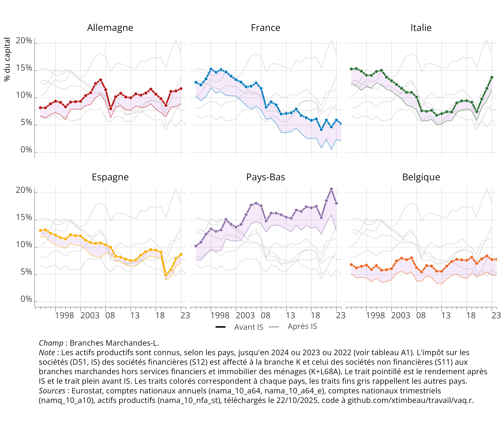
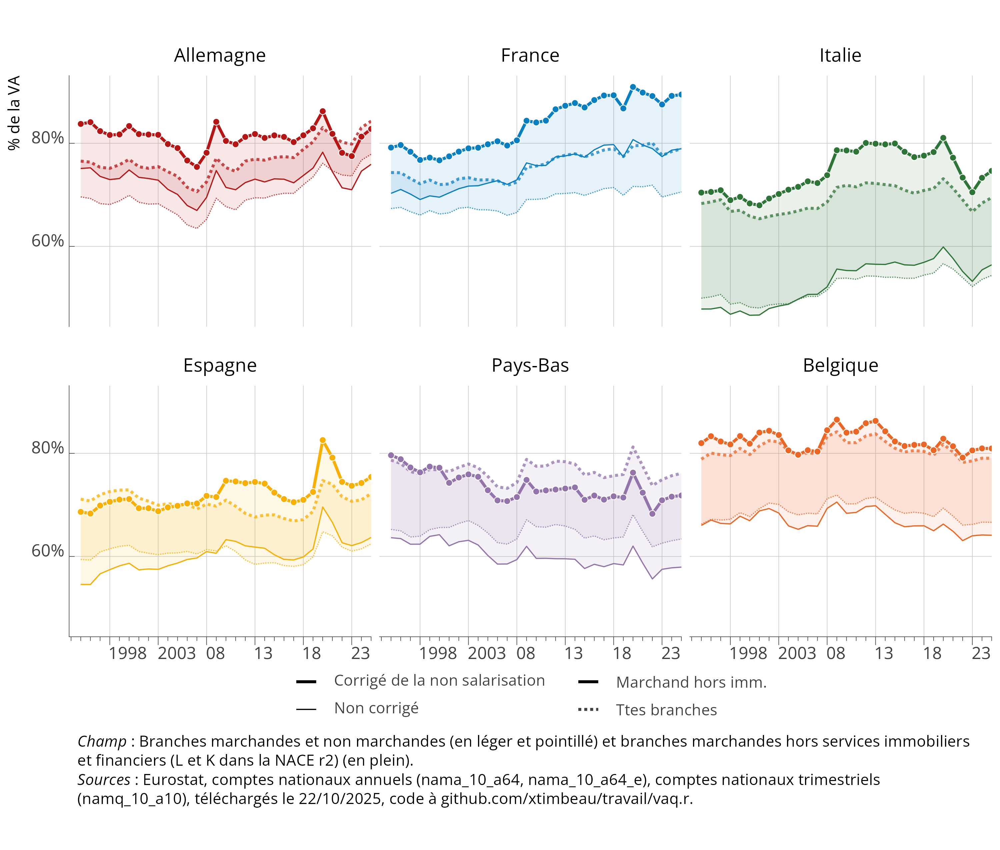
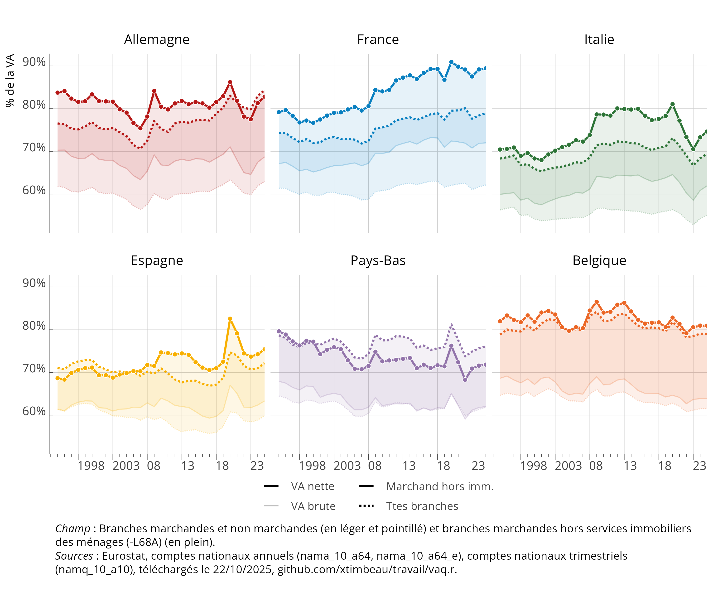
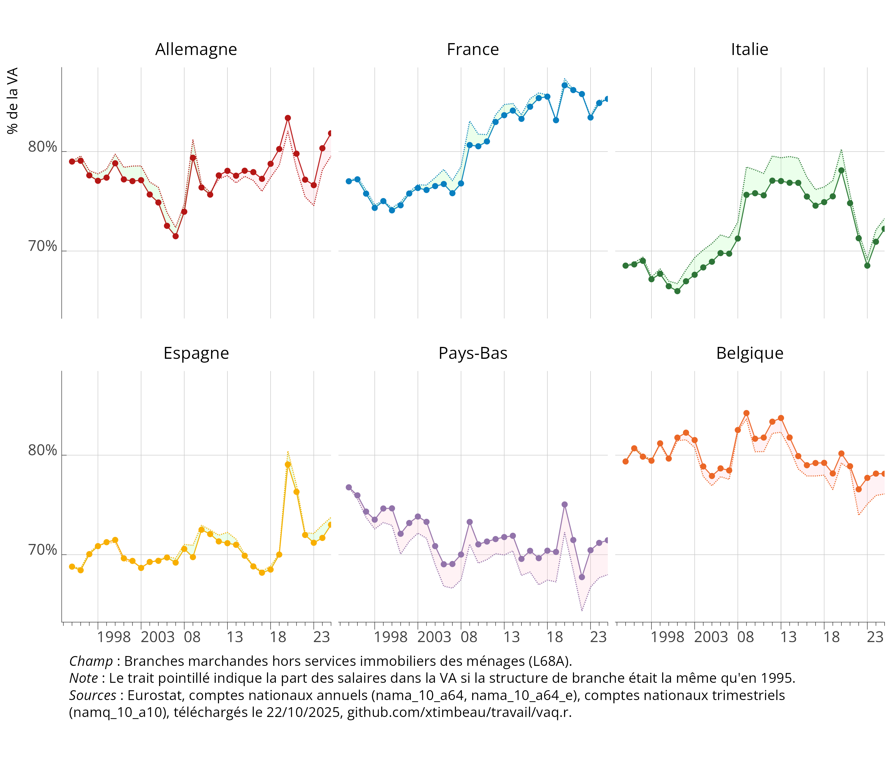
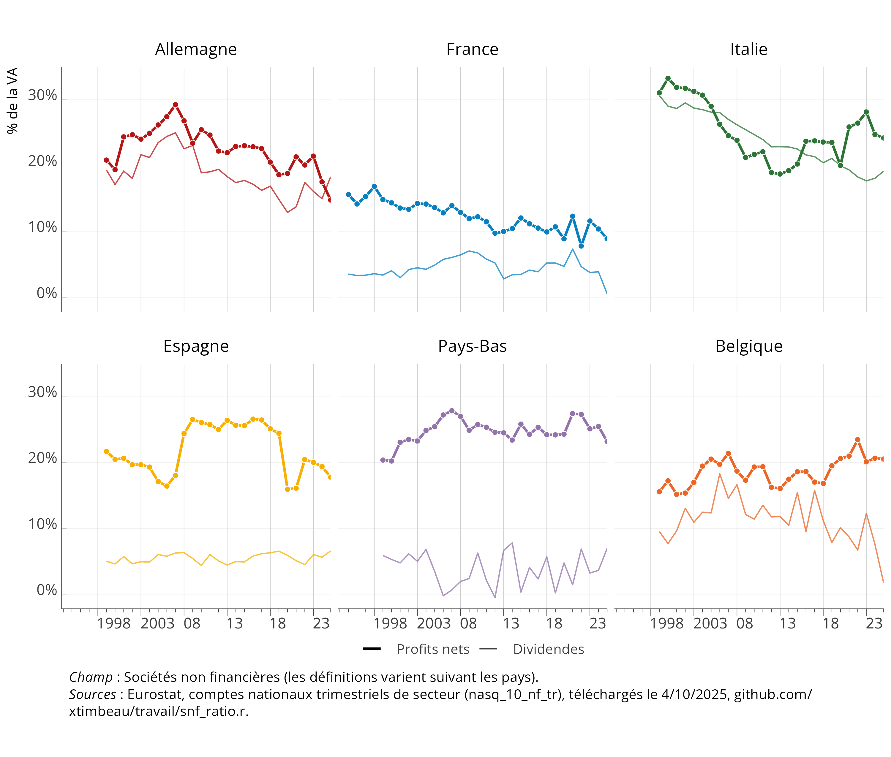
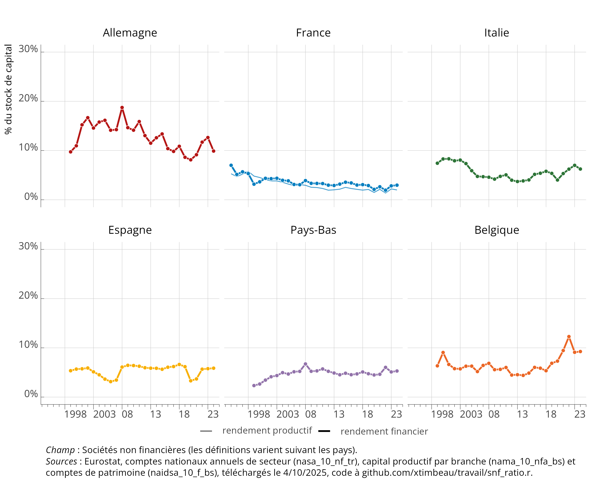

## Du partage de la VA au partage des richesses

L'analyse du partage de la valeur ajoutée (@fig-psal) est au cœur des débats sur la redistribution des richesses (voir notamment @hurlin1996, @timbeau2002, @cotis2009, @husson2010, @askenazy2012, @piton2019, @timbeau2025). Un indicateur souvent retenu est celui de la part des salaires dans la valeur ajoutée. Nous discutons ici de la construction de cet indicateur et de sa comparabilité entre pays (européens ou non).

::: {.cell}
::: {.cell-output-display}
{#fig-psal fig-pos='H' width=100%}
:::
:::

Trois points sont importants pour disposer du bon concept :

-   Corriger des non salariés et leur imputer une masse salariale. Cette correction est standard. Elle repose sur des hypothèses importantes comme le salaire affecté à un non salarié. Nous utilisons la décomposition en branches (ou en secteurs dans certains pays) pour affecter aux non salariés d'une branche le salaire moyen des salariés de cette branche. C'est une hypothèse assez forte, mais qu'il est difficile de dépasser. Elle a des conséquences pour les comparaisons entre périodes pour un même pays parce que la part des non salariés varie dans le temps, de façon différente suivant les branches et entre pays.

-   Définir le champ considéré. Il est plus facile de faire le calcul au niveau le plus agrégé, mais ce champ inclut les branches non marchandes dans lesquelles la notion de prix et donc de valeur ajoutée est parfois conventionnelle. Parmi les branches marchandes, la branches des services immobiliers est problématique parce qu'elle prend en compte la valeur ajoutée des ménages au travers des services immobiliers qui sont pour par auto produit (les loyers imputés aux propriétaires). La notion de partage de la valeur ajoutée n'a ici pas beaucoup de sens et la comparaison d'un pays à l'autre peut être très perturbée. La notion privilégiée est donc celle de partage de la valeur ajoutée dans les branches marchandes hors services immobiliers des ménages ou, de façon plus précise, en enlevant de la valeur ajoutée marchande la sous branche "*loyers imputés aux propriétaires occupants* (L68a)" et en considérant que la masse salariale et l'emploi salarié ou non salarié associés aux services produits par les ménages sont nuls.

-   Utiliser la notion de valeur ajoutée nette (de la consommation de capital fixe (CCF)) plutôt que brute. Rappelons que la valeur ajoutée nette est construite en ôtant de la valeur ajoutée brute la consommation de capital fixe. Cette dernière notion découle de l'application de tables de mortalité à un inventaire permanent des investissements non financiers (i.e. les investissements physiques mais aussi ceux en logiciels ou en base de données ainsi que les investissements intangibles comme les marques). En traitant les investissements comme une consommation intermédiaire mesurée par leur amortissement physique ou fiscal, on est plus proche de la réalité du processus productif. Lorsque le taux de dépréciation du capital varie, par des changement dans les tables de mortalité, des changements dans la composition du capital ou des changements dans la structure par branche de l'économie, la CCF rapportée à la valeur ajoutée varie et modifie donc la perception des évolutions du partage de la valeur ajoutée. La notion de valeur ajoutée nette est meilleure pour des comparaisons dans l'espace ou dans le temps. Comme pour la correction pour les non salariés, la prise en compte de la valeur ajoutée nette modifie dans le temps et dans l'espace la part des salaires dans la valeur ajoutée.

Le concept que nous privilégions est donc défini comme suit (où, pour chaque branche $D1_b$ est la masse salariale chargée, $B1G_b$ la valeur ajoutée brute, $P51C_b$ la $CCF_b$, les trois notions en euros aux prix courants et $ns_b$ et $sal_b$ les effectifs en personne par branche) :

$$
s_{net, n.s., -L68AOQ}  = \frac{\sum_{b\in{TT-L68AOQ}}{D1_b*(1+ns_b/sal_b)}}{\sum_{b\in{TT-L68AOQ}}{B1G_b - P51C_b}}
$$

La part des salaires dans la valeur ajoutée nette est croissante en France (@fig-psal) (de 10 points de 1998 à 2025), comme en Espagne (de 9 points). Elle atteint en France le niveau le plus élevé des pays sélectionnés, pour autant que l'on puisse comparer entre pays.

Théoriquement, l'évolution de part des salaires dans la valeur ajoutée dépend de la fonction de production agrégée (ce qui suppose qu'elle existe). Si l'élasticité de substitution entre le capital et la travail est unitaire alors on s'attend à ce que le partage soit indépendant du prix relatif du travail et du capital. La part des salaires est alors uniquement déterminée par la forme de la fonction de production et devrait converger dans tous les pays vers une valeur semblable, par diffusion de la technologie. Une structure de l'économie par branche différente peut cependant se traduire par des parts différentes d'un pays à l'autre.

L'élasticité estimée généralement, au moins à moyen terme, est sensiblement inférieure à 1, en tout cas sur données macroéconomique. Cela implique qu'une hausse du prix du travail relativement par au capital se traduit par une hausse de la part du travail dans la valeur ajoutée – la réciproque étant bien entendu vraie si c'est le capital qui est relativement plus cher. Cela peut conduire à des variations plus persistantes de la part des salaires dans la valeur ajoutée, mais ces variations doivent reproduire celles des prix relatifs.

La part des salaires dans la valeur ajoutée est la plus basse aux Pays-Bas et est sur une pente décroissante depuis plus de 20 ans, alors qu'elle semble stable en Belgique et en Allemagne. L’Italie affiche une variabilité temporelle importante, avec un pic de la part des salaires dans la valeur ajoutée en 2013, puis une franche décroissance (de plus de 13 points) interrompue dans la période récente suite à la période d'inflation et la forte relance budgétaire.

En France, la hausse est franche après la crise financière de 2008, suivant une période de grande stabilité de 1995 à 2007. Cette hausse peut découler d'un effet de structure sectorielle, mais le @fig-salaires indique une autre singularité française. Contrairement à de nombreux pays, les salaires réels sont restés sur une pente croissante, interrompue par la phase d'inflation à partir de la fin de l'année 2021, alors que dans les 5 autres pays, 2008 marque une cassure dans la progression de salaires réels.

Depuis 2018, en France, la part des salaires est stabilisée, à un haut niveau (@fig-psal). L'inflation et le retard d'ajustement des salaires sur l'inflation explique probablement cette trajectoire. On observe des mouvements comparables dans d'autres pays, bien que plus violent en Allemagne ou en Italie par exemple.

Au début des années 2000, deux pays se distinguaient des autres (l'Espagne et l'Italie) par une part des salaires plus faibles. L'écart avec l'Allemagne atteignait alors plus de 15 points. En généralisant l'approche aux pays de l'Union Européenne, on peut en partie confirmer cette hypothèse (@fig-psaleu). Les pays qui ont connu un développement rapide, et donc des niveaux d'investissement élevés, on eu des parts des salaires basses (La Bulgarie, la Tchéquie, la Grèce par exemple). Mais ce n'est pas une observation systématique : certains pays moins développés ont eu par le passé une part très élevée des salaires dans la valeur ajouté, témoignant peut être de modes de formation des salaires et d'inflation particulier et hérités du passé. Cependant, comme le suggèrent la position singulière de quelques petits pays, parmi lesquels l'Irlande, le Luxembourg, Malte, Chypre ou les Pays-Bas dans une certaine mesure, c'est peut être du côté du déplacement de la base imposable des profits (optimisation fiscale), des prix de transferts et d'une position très particulière dans la chaîne de valeur qu'il faut aller chercher l'explication de très faibles parts des salaires dans la valeur ajoutée.

:::: {#fig-psaleu} 

::: {.cell}
::: {.cell-output-display}
{#fig-psaleu-1 fig-pos='H' width=100%}
:::
:::

Part des salaires dans la VA nette 1995 et 2025

::::

La construction d'un taux de rendement du capital est sans doute assez fragile parce qu'il faut ajouter à l'évaluation du partage de la valeur ajoutée une estimation des impôts payés (notamment l'impôt sur les sociétés) et une évaluation du stock de capital. En utilisant les données de stock de capital productif le diagnostic présenté sur le @fig-psal est confirmé par le @fig-rp. La France y occupe une position singulière avec un rendement du capital productif particulièrement faible et décroissant depuis le début des années 2000 alors qu'il est constant dans beaucoup de pays ou même croissant comme aux Pays-Bas. Une explication possible est le déplacement de la base fiscale en Europe comme le suggèrent @tørsløv2022.

::: {.cell}
::: {.cell-output-display}
{#fig-rp fig-pos='H' width=100%}
:::
:::

On détaille en les discutant dans la suite de ce document les effets des corrections appliquées, ainsi que la différence entre les mesures dérivées des comptes de branche ou des comptes d'agents. Ces éléments sont un peu fastidieux, mais ils s'avèrent assez importants et pas toujours très intuitifs.

On explore également les conséquences en matière de taux de profit (part des profits nets dans la valeur ajoutée) ou rendement du capital (profits nets divisés par les actifs).

## Evolution des salaires réels

L'évolution des salaries réels est un complément à celle du partage de la valeur ajoutée. Pour passer de l'un à l'autre, il faut non seulement prendre en compte les évolutions de la valeur ajoutée, mais aussi les effets de l'évolution du ratio prix à la consommation sur prix de valeur ajoutée.

On déflate la masse salariale (comptabilité nationale, comptes trimestriels) par les prix à la consommation. On utilise les masses salariales ($D1$, dans [`namq_10_a10`](https://ec.europa.eu/eurostat/databrowser/view/NAMQ_10_A10/default/table?lang=en)) par branches pour comparer branches (principalement) marchandes et (principalement) non marchandes divisées par l'emploi salarié ([`namq_10_a10_e`](https://ec.europa.eu/eurostat/databrowser/view/NAMQ_10_A10_E__custom_7475124/default/table?lang=en)). Les prix sont les déflateurs de la consommation ($P31\_S14$ dans [`namq_10_fcs`](https://ec.europa.eu/eurostat/databrowser/product/page/NAMQ_10_FCS)) chaînés (voir le code pour les détails).

On distingue 4 agrégations : l'ensemble des branches (ou l'ensemble de l'économie), les branches non marchandes, les branches marchandes et les branches marchandes hors immobilier.

::: {.cell}
::: {.cell-output-display}
{#fig-salaires fig-pos='H' width=100%}
:::
:::

En Italie et en Espagne, la masse salariale dans les branches non marchandes est supérieures à celle des branches non marchandes. Aux Pays-Bas et en Allemagne il n'y a pas de différence notable. En France, elle est significativement plus basse. Notons que les branches non marchandes ne sont pas nécessairement de l'emploi public et ce dans des proportions variables suivant les pays. Dans tous les pays, la masse salariale des branches immobilier et (surtout) services financiers est plus élevée que la masse salariale dans les autres branches marchandes.

## Part des salaires dans la valeur ajoutée, comptes de branche

On utilise les données de comptabilité nationale, en trimestriel, par branche ([`nasq_10_nf_tr`](https://ec.europa.eu/eurostat/databrowser/view/nasq_10_nf_tr/default/table?lang=en)), ré-agrégées au niveau de l'ensemble de l'économie. Le passage par les comptes de branches permet de distinguer branches marchandes et non marchandes ou d'autres regroupements, comme l'exclusion des services immobiliers. Ce passage permet également de conduire la correction salariés non salariés au niveau des branches. D'après l'INSEE, (voir le blog "[Combien pèse l'industrie en France et en Allemagne](https://blog.insee.fr/combien-pese-l-industrie-en-france-et-en-allemagne/)"), tous les pays ne produisent pas une comptabilité de branche mais pour certains (notamment l'Allemagne) une comptabilité sectorielle. La différence tient aux entreprises qui produisent plusieurs produits (un constructeur automobile propose des services financiers pour l'achat des véhicules) et dont l'activité est imputé à différentes branches (industrie et services financiers) dans la comptabilité de branche alors que dans une comptabilité de secteur l'acitvité est versée dans le principal secteur (ou le secteur d'immatriculation de l'entreprise chapeau). Cette différence empêche normalement les comparaisons des comptes de branches entre pays, y compris à l'intérieur de l'Union Européenne. Cependant, pour comparer la part des salaries dans la valeur ajoutée sur des agrégats larges (branches marchandes par exemple), cette dérogation à la norme comptable n'est que modérément problématique : de toute façon, l'automobile et les services financiers sont agrégés et c'est la correction pour la masse salariale des non salariés qui peut être modifiée. Mais si la même délimitation est employée pour les salariés et les non salariés que pour l'activité, l'erreur est probablement minime.

La part des salaires est corrigée de la part des non salariés (données annuelles [`nama_10_a64_e`](https://ec.europa.eu/eurostat/databrowser/view/nama_10_a64_e/default/table?lang=en), extrapolées en maintenant le ratio salariés/non salariés à sa dernière valeur observée) en considérant que le salaire des non salariés est identique dans chaque branche à celui des salariés – cette hypothèse sous estime probablement le salaire des non salariés mais elle est difficile à lever, sauf à utiliser les enquêtes force de travail et faire confiance aux revenus qui y sont déclarés, en perdant la variation d'une année à l'autre. En revanche, on prend bien en compte que les non salariés de la branche agricole n'ont pas le même revenu que ceux de la branche "information et communication". La décomposition employée est à 9 branches et on peut conduire la même correction à un niveau de désagrégation plus fin.

La masse salariale est rapportée soit à la valeur ajoutée brute ($B1G$), soit à la valeur ajoutée nette ($B1N=B1G-P51C$). Comme la consommation de capital fixe ($P51C$) n'est pas connue en trimestriel, elle est dérivée des comptes annuels en 21 branches (niveau 1 de la NACE rev2 [`nama_10_a64`](#0)), agrégée en 9 branches, puis extrapolée pour les années non connues (ici 2024 et 2025) en conservant un ratio constant dans la valeur ajouté brute. Le détail se trouve dans le code.

Les trois graphiques suivants illustrent les conséquences sur la mesure de la part des salaires suivant les différents concepts. Le @fig-psalcnc compare avec et sans correction pour les non salariés. Deux rubans sont affichés, l'un pour les branches marchandes hors services immobiliers et financiers et l'autre pour toutes les branches.

L'avantage des comptes de branches est une définition homogène pour chacun des pays. La branche immobilier est exclue parce qu'il est impossible de distinguer les entreprises des ménages propriétaires (les loyers imputés sont une valeur ajoutée des ménages).

Les données trimestrielles sont annualisées pour la lisibilité et pour simplifier le mélange de données annuelles et trimestrielles. Le point 2025 (la dernière année) est donc un acquis sur les trimestres observés de l'année (ici 2 trimestres sur 4) suceptible de changer au fur et à mesure du temps. Il est possible en modifiant le code de produire un graphique trimestriel ou trimestriel lissé, à votre convenance.

::: {.cell}
::: {.cell-output-display}
{#fig-psalcnc fig-pos='H' width=100%}
:::
:::

La correction de la non salarisation, en imputant une masse salariale pour les entrepreneurs individuels, augmente la part des salaires. La correction n'est pas constante dans le temps (c'est particulièrement fort pour la France) ni dans l'espace (la correction est très forte en Italie). La correction est plus importante lorsqu'on se limite aux branches marchandes hors services immobiliers et services financiers, sauf aux Pays-Bas.

::: {.cell}
::: {.cell-output-display}
{#fig-psalnetbrut fig-pos='H' width=100%}
:::
:::

La notion de part des salaires dans la valeur ajoutée nette consiste à réduire le démominateur (la valeur ajoutée) de la consommation de capital fixe. Cela augmente donc le ratio. Cependant, cette correction n'est pas constante dans le temps (comme en France, en Espagne ou en Belgique). Comme on peut le voir sur le @fig-psalcompote, la variance entre les pays est plus basse pour la notion brute (non corrigé de la CCF) que nette. Pour les branches marchandes hors services immobiliers et services immobiliers, le classement entre pays est marginalement modifié, la Belgique ayant une part des salaires nette pus élevée que l'Allemagne, alors que sa part brute est plus faible qu'en Allemagne. Pour les autres pays, le classement est indentique (La France a la part la plus haute et les Pays-Bas plus faible).

::: {.cell}
::: {.cell-output-display}
{#fig-psalcompote fig-pos='H' width=100%}
:::
:::

::: {#tbl-rang .cell tbl-cap='Part des salaires dans la VA et rang, différents concepts'}
:::: {#tbl-rang} 

::: {#tbl-rang-1 .cell}
::: {.cell-output-display}
\begin{table}
\fontsize{12.0pt}{14.0pt}\selectfont
\begin{tabular*}{\linewidth}{@{\extracolsep{\fill}}llrrrrrrrr}
\toprule
 &  & \multicolumn{4}{c}{Part des salaires dans la VA en 2023} & \multicolumn{4}{c}{Rang en 2023} \\ 
\cmidrule(lr){3-6} \cmidrule(lr){7-10}
 &  & Nette, avec n.s. & Nette, sans n.s. & Brute, avec n.s. & Brute, sans n.s. & Nette, avec n.s. & Nette, sans n.s. & Brute, avec n.s. & Brute, sans n.s. \\ 
\midrule\addlinespace[2.5pt]
SI & Slov\\'enie & 89.0\% & 72.3\% & 70.0\% & 56.9\% & 1 & 3 & 1 & 1 \\ 
FI & Finlande & 81.0\% & 74.5\% & 58.2\% & 53.6\% & 2 & 1 & 15 & 8 \\ 
LV & Lettonie & 80.2\% & 70.0\% & 63.4\% & 55.3\% & 3 & 6 & 2 & 3 \\ 
BE & Belgique & 80.1\% & 67.6\% & 62.1\% & 52.4\% & 4 & 8 & 3 & 12 \\ 
DE & Allemagne & 80.1\% & 73.8\% & 59.8\% & 55.1\% & 5 & 2 & 10 & 4 \\ 
AT & Autriche & 78.5\% & 70.1\% & 59.2\% & 52.9\% & 6 & 4 & 11 & 10 \\ 
FR & France & 77.6\% & 69.6\% & 61.1\% & 54.7\% & 7 & 7 & 7 & 5 \\ 
EE & Estonie & 76.3\% & 67.3\% & 61.7\% & 54.4\% & 8 & 9 & 4 & 6 \\ 
PT & Portugal & 76.3\% & 65.7\% & 60.3\% & 52.0\% & 9 & 11 & 9 & 13 \\ 
HR & Croatie & 75.2\% & 65.8\% & 61.5\% & 53.8\% & 10 & 10 & 5 & 7 \\ 
NL & Pays-Bas & 74.9\% & 62.6\% & 60.8\% & 50.8\% & 11 & 14 & 8 & 15 \\ 
DK & Danemark & 74.0\% & 70.0\% & 58.7\% & 55.5\% & 12 & 5 & 13 & 2 \\ 
CZ & Tch\\'equie & 70.9\% & 60.9\% & 53.3\% & 45.8\% & 13 & 17 & 19 & 20 \\ 
BG & Bulgarie & 70.9\% & 56.9\% & 61.4\% & 49.3\% & 14 & 19 & 6 & 17 \\ 
ES & Espagne & 70.7\% & 61.0\% & 58.4\% & 50.4\% & 15 & 16 & 14 & 16 \\ 
LT & Lituanie & 69.1\% & 61.5\% & 58.9\% & 52.4\% & 16 & 15 & 12 & 11 \\ 
SE & Su\`ede & 68.6\% & 65.1\% & 53.8\% & 51.1\% & 17 & 12 & 18 & 14 \\ 
IT & Italie & 67.1\% & 52.5\% & 53.1\% & 41.6\% & 18 & 22 & 20 & 24 \\ 
LU & Luxembourg & 66.7\% & 62.8\% & 56.5\% & 53.2\% & 19 & 13 & 16 & 9 \\ 
SK & Slovaquie & 64.5\% & 56.0\% & 52.0\% & 45.1\% & 20 & 20 & 22 & 21 \\ 
HU & Hongrie & 64.4\% & 60.0\% & 50.3\% & 46.8\% & 21 & 18 & 23 & 19 \\ 
PL & Pologne & 61.4\% & 48.3\% & 54.1\% & 42.6\% & 22 & 24 & 17 & 23 \\ 
MT & Malte & 60.3\% & 52.5\% & 48.9\% & 42.6\% & 23 & 23 & 24 & 22 \\ 
CY & Chypre & 60.1\% & 54.5\% & 52.5\% & 47.6\% & 24 & 21 & 21 & 18 \\ 
GR & Gr\`ece & 56.5\% & 44.2\% & 47.5\% & 37.2\% & 25 & 26 & 25 & 26 \\ 
RO & Roumanie & 53.9\% & 46.4\% & 47.4\% & 40.8\% & 26 & 25 & 26 & 25 \\ 
IE & Irlande & 44.5\% & 38.5\% & 32.6\% & 28.2\% & 27 & 27 & 27 & 27 \\ 
\bottomrule
\end{tabular*}
\end{table}

Ttes branches
:::
:::

::::
:::

## Impact du changement de structure de l'économie

On peut décomposer le changement de la part des salaires dans la valeur ajoutée en un effet de structure en branche et un effet de changement de la part des salaires dans la valeur ajoutée dans chaque branche. Formellement la décomposition retenue s'écrit (où $w_{b,t}$ est la part de VAN de la branche $b$ dans la valeur ajoutée nette de l'ensemble des branches considérées et $s_{b,t}$ la part des salaires dans la branche $b$) :

$$
s_t - \sum w_{b,1995} \times s_{b,1995} =  \sum w_{b,1995} \times (s_{b,t}-s_{b,1995}) + \sum (w_{b,t} - w_{b,1995}) \times s_{b,t}  
$$

L'année 1995 est l'année de référence et le premier terme (de droite) s'interprète comme la part des salaires qui prévaudrait s'il n'y avait pas eu de changement de structure. Le @fig-structbanche représente ce terme ainsi que la part agrégée des salaires ($s_{t}$). Leffet de la structure par branche de l'économie (ici marchande hors services immobiliers produits par les ménages) est assez marginale. Les variations de la part des salaires sont bien celle des parts des salaires dans chaque secteur.

Il existe quelques exceptions à cette régle générale. A structure de branche inchangée, avec comme année de référence 1995, la part des salaires serait plus basse de 3,5 points de VA pour les Pays-Bas en 2025. En Allemagne ou en Belgique, le changement de structure des branches explique un petit peu de l'évolution à la hausse.

En revanche, la part des salaires serait légèrement supérieure en Italie à structure inchangée. Le pic de valeur ajoutée en 2013 est lié entièrement à la structure par branche, ce qui laisse supposer une rupture de série dans les comptes de branche.

::: {.cell}
::: {.cell-output-display}
{#fig-structbranche fig-pos='H' width=100%}
:::
:::

## Part des salaires dans la valeur ajoutée, comptes d'agents

Les comptes d'agents (ou de secteurs institutionnels) permettent une analyse plus simple, parce qu'ils permettent de distinguer les seules entreprises non financières. Cela évite d'avoir à prendre en compte les non salariés, cela exclue les services immobiliers produits par les ménages. C'est donc une analyse sur un champ économique plus strict (au sens de la forme légale des entités considérées). La notion d'impôt sur les sociétés est aussi mieux définie et le stock de capital productif est mieux connu du fait de l'obligation légale de déclaration des comptes des entreprises.

Malheureusement, comme identifié par l'INSEE, la pratique des instituts nationaux européens n'est pas conforme à celle de l'INSEE. Par exemple, en Allemagne, le secteur S11 inclut les quasi-sociétés et les entrepreneurs individuels. La normalisation des concepts est par ailleurs peu probable dans le futur, puisqu'elle est liée aux pratiques administratives.

Comme pour les graphiques précédents, les données trimestrielles sont annualisées (pour éliminer la variabilité trimestrielle qui nuit à la lisibilité et qui n'a pas beaucoup de sens). En trait pointillé, on représente la part de la valeur ajoutée dans les branches marchandes hors immobilier et corrigée de la non salarisation pour mesurer la différence des concepts.

::: {.cell}
::: {.cell-output-display}
{#fig-s11psal fig-pos='H' width=100%}
:::
:::

::: {.cell}
::: {.cell-output-display}
{#fig-s1112psal fig-pos='H' width=100%}
:::
:::

## Profits nets et dividendes dans les comptes d'agents

Les comptes des sociétés non financières permettent d’examiner d'autres éléments du compte. On affiche ici le profit net sur la valeur ajoutée nette, et le taux de dividendes nets sur la valeur ajoutée nette.

Les profits nets sont définis comme la valeur ajoutée nette de la consommation de capital fixe moins la rémunération des salariés, moins les taxes nettes des subventions moins l'impôt sur les sociétés :

$$
\Pi = B1G - P51C - D1 - (D2-D3) - D5 = B2N-D5
$$

Les dividendes sont la ligne $D42$ nette de ce qui est payé et reçu par le secteur des sociétés non financières (SNF ou S11).

::: {.cell}
::: {.cell-output-display}
{#fig-profits fig-pos='H' width=100%}
:::
:::

On peut rapporter ces notions aux éléments qui viennent du compte de capital. Le premier concept est le profit rapporté au stock de capital physique (tel que valorisé dans la comptabilité nationale, c'est-à-dire à la valeur de remplacement et au prix de marché). Malheureusement, à part la France, aucun pays dans notre échantillon ne diffuse ces données sur Eurostat.

On rapporte également à une notion financière, à savoir la valeur nette des actions au passif des comptes d'entreprises. Les conventions de valorisation des actions non cotées sont délicates et difficiles à suivre d'un pays à l'autre. On choisit ici d'augmenter ces actions de la valeur nette résiduelle des entreprises non financières ($BF90$). On a donc :

$$
\begin{aligned}
r_{productif} & = \frac{\Pi}{N1N+N2N} \\
r_{financier} & = \frac{\Pi}{F51+F52+BF90}
\end{aligned}
$$

On obtient le graphe suivant :

::: {.cell}

:::

:::: {#fig-tprofitsnff} 

::: {.cell}
::: {.cell-output-display}
{#fig-tprofitsnff-1 fig-pos='H' width=100%}
:::
:::

Rendements du capital, compte de secteur

::::

## Profits nets dans les comptes de branche

En utilisant d'une part la valeur ajoutée des branches marchandes hors services immobiliers produits par les ménages et la valeur des actifs productifs issue de la base des stocks de capital productif ([nama_10_nfa_st](https://ec.europa.eu/eurostat/databrowser/view/NAMA_10_NFA_ST__custom_2046386/default/table?lang=en)) sur le même champ (i.e. en enlevant la sous branche L68A), on peut estimer un rendement du capital productif.

:::: {#fig-tprofitbranches} 

::: {.cell}
::: {.cell-output-display}
{#fig-tprofitbranches-1 fig-pos='H' width=100%}
:::
:::

Rendements du capital, compte de branches, marchand hors services immobiliers produits par les ménages

::::

Le rendement calculé sur le @fig-tprofitbranches diffère de celui du @fig-tprofitsnff. La différence vient en partie de la difficulté à imputer l'impôt des sociétés aux seules entreprises des branches marchandes – des entités légales dans les branches non marchandes peuvent être soumises à l'impôt sur les sociétés et de la valorisation des actifs. Dans l'approche comptes d'agents (ou de secteurs institutionnels), on affecte la valeur nette résiduelle des entreprises au stock de capital. De plus, le stock de capital n'est pas dans l'approche du @fig-tprofitsnff limité au capital productif mais intègre également des actifs financiers qui n'ont pas de contrepartie physique parce qu'ils sont hors territoire français.

La France conserve une singularité marquée par la baisse continue du taux de profit au cours du temps. Le rendement apparent du capital est ainsi très bas, plus bas que dans tous les autres pays considérés où il est plutôt stable (l'Italie fait exception avec une forte volatilité).

## Au delà de l'Europe

L'accès aux données de l'OCDE est devenu particulièrement opaque, mais je m'en suis sorti. Il est possible d'utiliser des données de comptabilité nationale, au niveau de l'ensemble de l'économie (y compris donc les branches non marchandes et l'immobilier). La correction pour la non-salarisation est assurée par les données de l'*Economic Outlook* (avec une trimestrialisation *ad hoc*). Au lieu de la valeur ajoutée, on utilise le PIB, auquel on enlève la consommation de capital fixe (dans les données OCDE, il n'y a pas de données de CCF pour le Japon). Le concept de part des salaires n'est donc pas tout à fait le même que dans les autres analyses.

On obtient ce graphique :

::: {.cell}
::: {.cell-output-display}
{#fig-psaloecd fig-pos='H' width=100%}
:::
:::

En revanche, Eurostat a un programme de coopération (avec l'OCDE) pour intégrer les données dans le cadre d'Eurostat (sans que les méthodes ne soient plus homogènes pour autant).

On utilise ces données ([`naidsa_10_nf_tr`](https://ec.europa.eu/eurostat/databrowser/view/naidsa_10_nf_tr__custom_13241966/default/table?lang=en)) pour construire des indicateurs comparables en comparant des pays autres que ceux de la zone euro.

::: {.cell}
::: {.cell-output-display}
{#fig-tprofithze fig-pos='H' width=100%}
:::
:::

### Références {.unlisted .unnumbered}

::: {#refs}
:::
